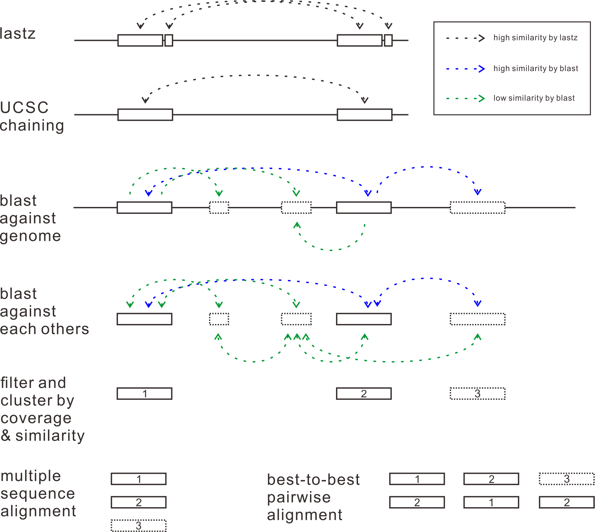

# Self-alignment

Another major function provided by EGA is self-alignment for paralog sequence detection.  

  

**Self-alignment:** First, genome sequences are aligned to itself to find some similar segments. The aligment tool is same with multiple alignment described above. 

**Chaining:** Related fragments are joined together by chaining algorithms to build longer candidates.  

**Two-wheeled blast:** In order to explore similar sequences at the most extent, candidates being chained above are used to perform two-wheeled blast against all of the whole genome.  

**Filter and cluster:** Pairs of similar sequences are then being filtered and clustered by coverage and similarity. Pairs which make up of more than 90% of each other and with a similarity value greater than 90% will be finally preserved.
