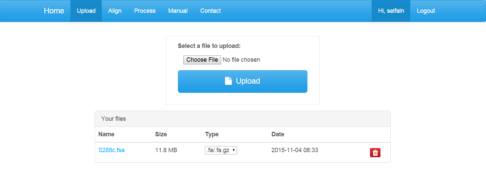
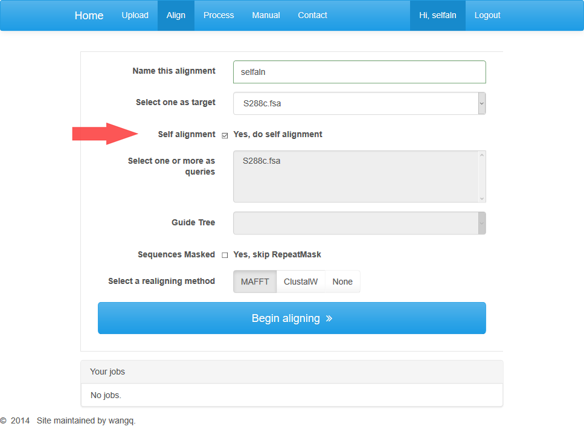
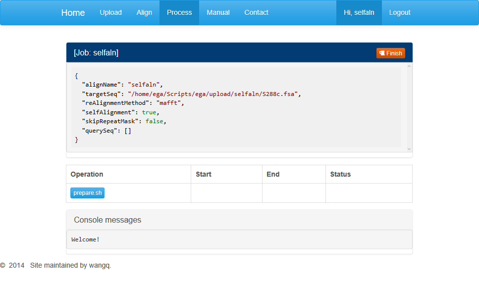
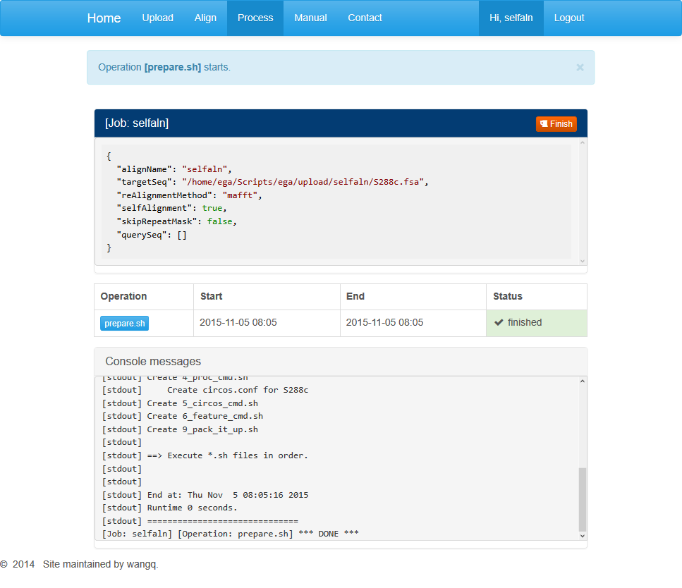
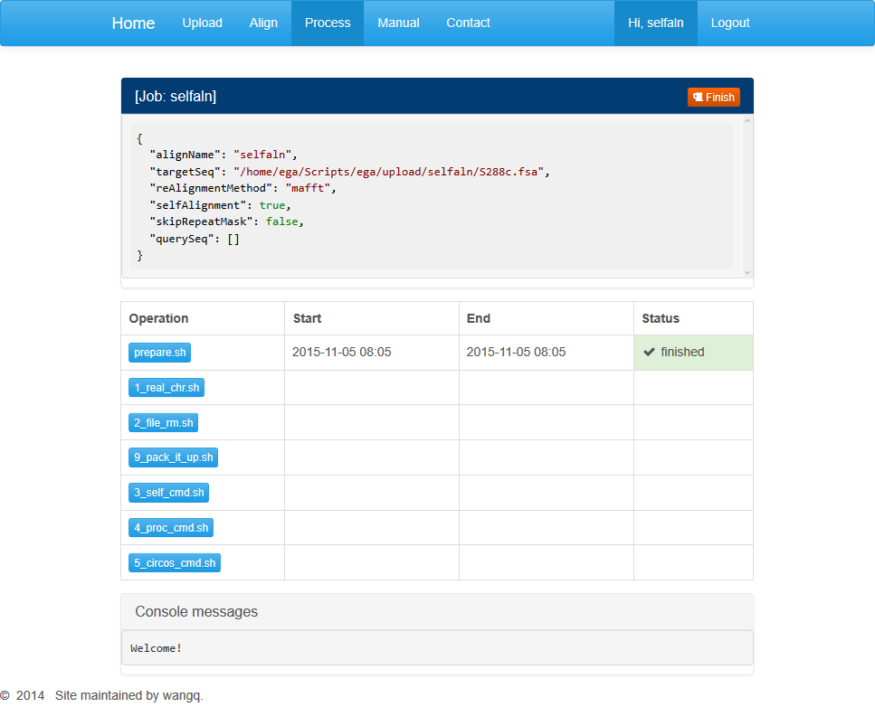
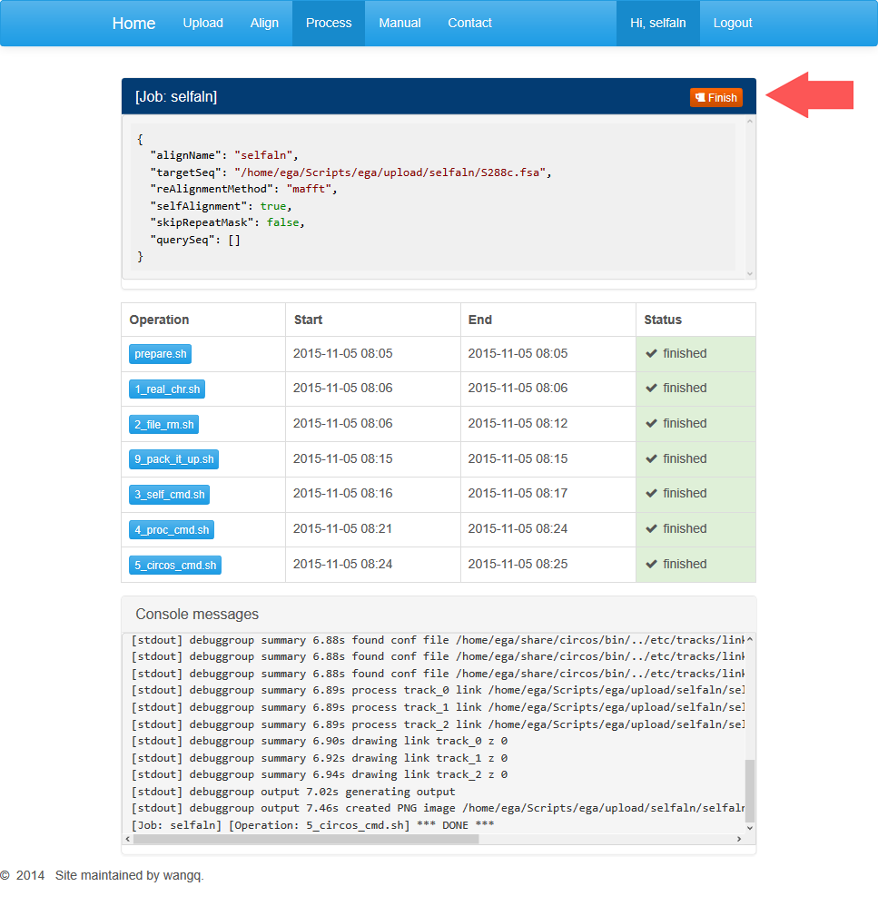
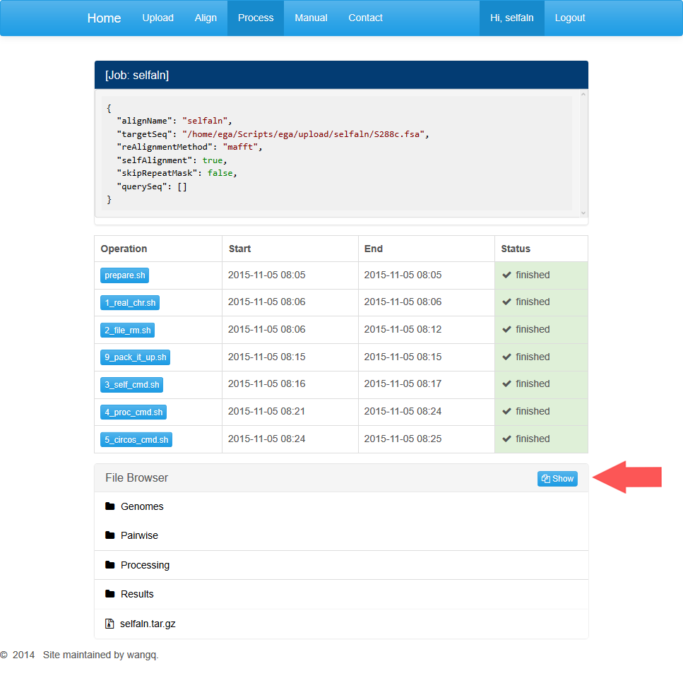

# Example 3: Self-alignment for Paralogous Detection

**Data download and file format change**
Here we take yeast S288c as an example. Sequences can be found in the download section of http://www.yeastgenome.org/download-data/sequence.

Rename the downloaded file with a brief name. This name will also be used as the genome name in result files. Since the yeast genome is not download from NVBI, We provide a command line for manually file format processing. Files processed can be used for alignment.

	perl -ne "if(/^\>/){s/\W+/_/g; s/^\_/>/; s/\_$/\n/;} print;" example.fasta

We also provided a test account stored with the data used for example tests. You can log into the account for paralog alignment with the username "paralog" and password "password".

**Upload**
click on "Upload" to enter the page after you log in the site. The upload page shows an upload dialog.  
  
If you need to upload a genome file, you can select a file in the open dialog box, and click on the “Upload” button. For a web-based alignment instead of process through a virtual machine, the individual file size is limited to 30M. Only three kinds of file types are accepted: .fasta, .fasta.gz, .newick. You can click on the red button to remove an uploaded file. _**Do not**_ refresh the page while uploading a file!

**Alignment**
You can click on the “Align” button on the menu to enter the align page.  
  
At this page you should set some parameters for the construction of alignments. Some parameters are required, such as the name of this alignment job and a target genome. In order to do paralog detection, you should check the “self alignment” box so that you cannot choose query genomes. We also provide a recommended realigning method.   

After parameter settings are completed, you can click on “Begin aligning” button to jump to the processing page automatically.  
  
This page displays three dialog boxes. The dialog above contains parameters set in the previous step. You can’t open a new job if the current one has not finished. When your job is completed or you want this job terminated, you can click on the red button at the top-right corner and open up a new task. Notice that terminated job can’t recover.  

The middle dialog contains buttons for different processing stages. Among them, the first step is data pre-processing. You can click on the “prepare.sh” to start a job running.  
  
The information section contains general information about the running task including the start and end times and running status. 

Below is progress information for the particular run step. When the last line shows “\***DONE***”, the step is supposed to be completed. Users may refresh this page and move on to the next step. 

After the pre-processing completes, refresh the page and buttons for the rest steps will appear in the middle dialog box. Users may click on buttons in sequence  to generate an alignment.  
  
For every step, when the last line shows “\***DONE***”, the task is completed and you can move on to the next step.

**Downloading results**
After all jobs are done, users may click on the red “finish” button and download the results generated in every step.  
  
  