**1. Install VirtualBox:**
It is necessary to download and install VirtualBox to provide the platform to run the VM(Virtual Machine). The current version of VirtualBox is 5.0.6 for both Mac and Windows. You can obtain it for free by visiting …….  
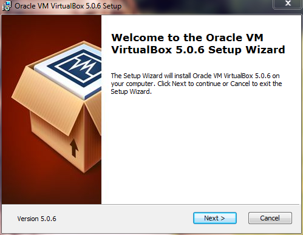  
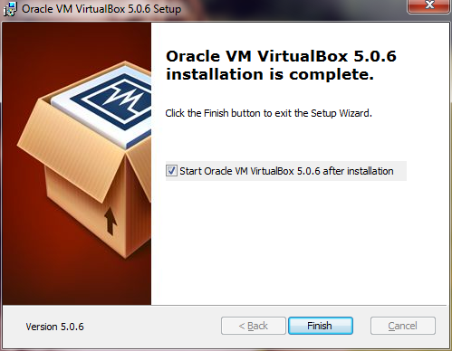  
After installing VirtualBox, users are required to install the extension pack of the same version, which can be obtained by visiting……

Double click on the extension pack, it will be installed automatically into VirtualBox.  
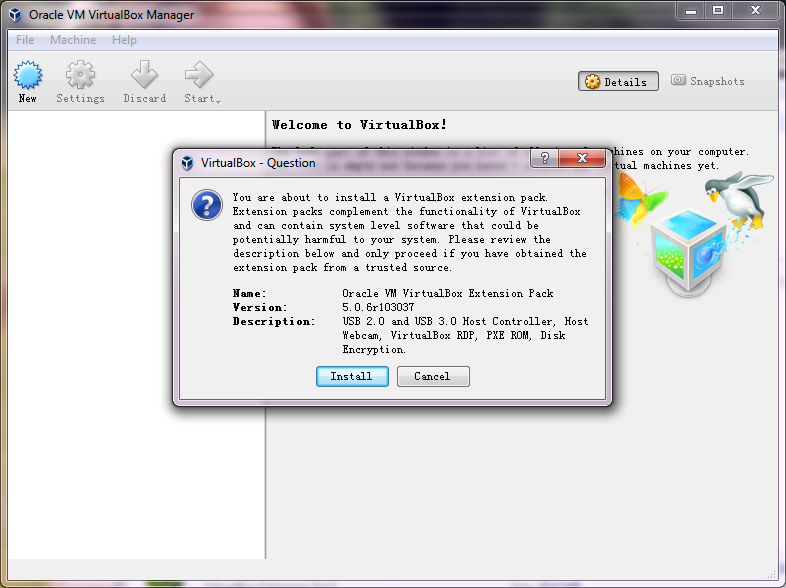  
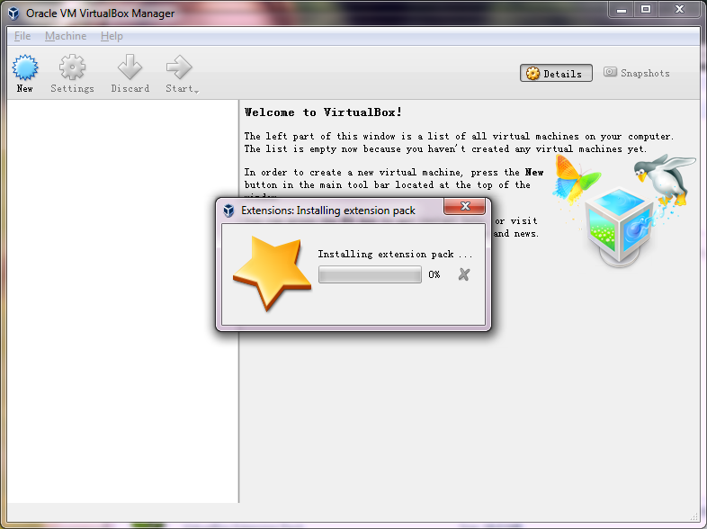  

**2. Download EGA VM and import it into VirtualBox:**
The EGA Virtual Machine (egavm.ova) can be downloaded from ……

Once complete, start VirtualBox and click on “File”, then choose “Import virtual machine”.   
  
Choose egavm.ova in the current dialog box to start the import.

Make sure the OS Type is “Ubuntu (64 bit)” and RAM meets the requirement.  
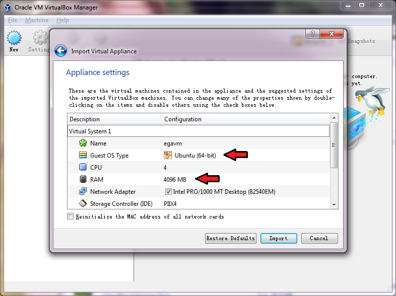  
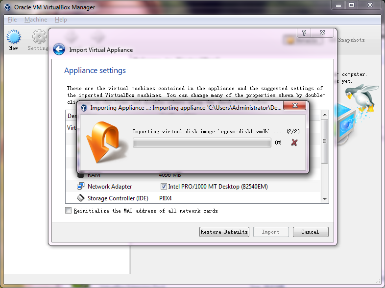  
After successfully importing the VM, you will see the following window. The VM is now in a stopped state.  
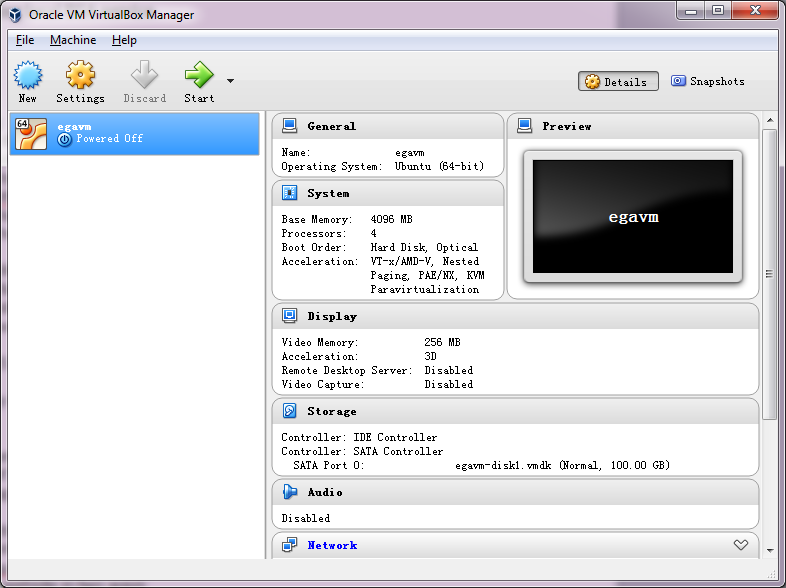  

**3.Start VM and open a terminal window in the VM GUI:**
Click on the “Start” button and wait for the VM to start. This may take a few seconds. Then, the desktop will appear as below.  
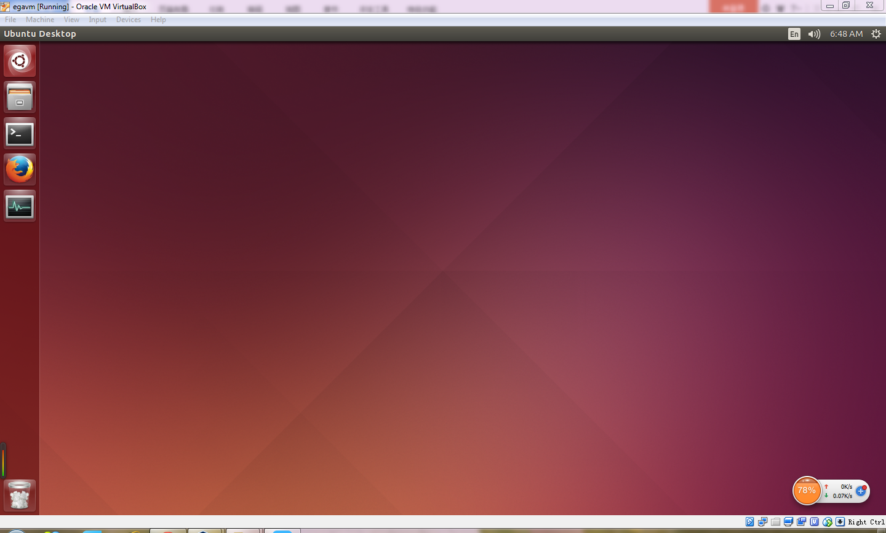  

**4. Visit the EGA website:**
Click on the terminal icon on the panel on the left, and run the following command :
	cd ~/Scripts/ega && node app.js  
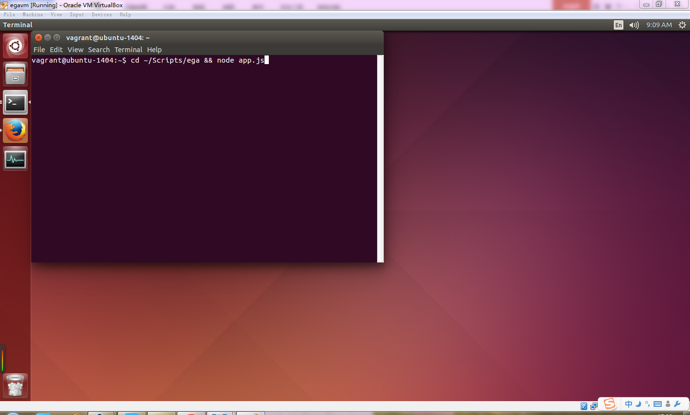  
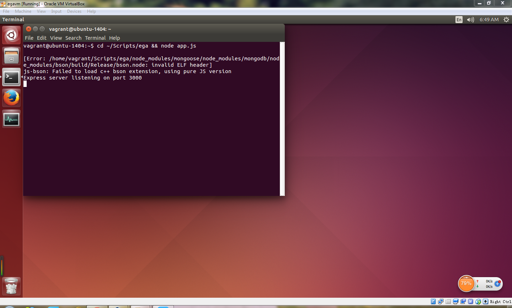  
You can visit the website in two ways:

	Either outside the VM GUI, open your browser and visit http://localhost:30080
	or, inside VM GUI, open browser and visit http://localhost:3000  
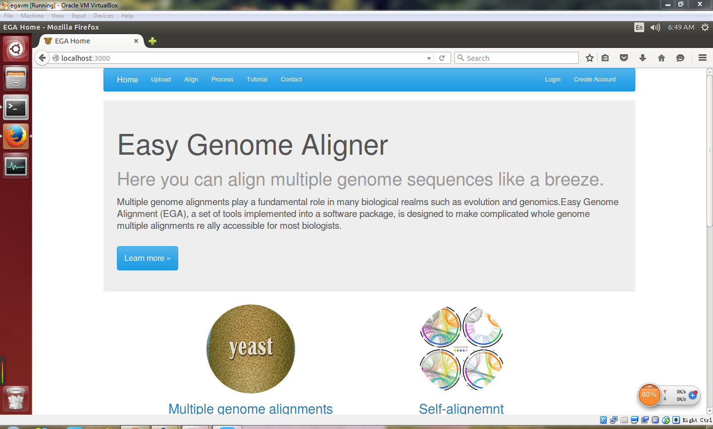  
		
**5. Follow the instructions in Part A to start your alignment.**  
Considering the reduction of efficiency in data uploading brought by port mapping, we recommend users to upload files inside the VM with shared folders. Instead of uploading through your local web browser, you may process the data afterwards with it. You can refer to FAQ about the configuration method of shared folders.# Instruction

**1. Install VirtualBox:**
It is necessary to download and install VirtualBox to provide the platform to run the VM(Virtual Machine). The current version of VirtualBox is 5.0.6 for both Mac and Windows. You can obtain it for free by visiting …….  
  
  
After installing VirtualBox, users are required to install the extension pack of the same version, which can be obtained by visiting……

Double click on the extension pack, it will be installed automatically into VirtualBox.  
  
  

**2. Download EGA VM and import it into VirtualBox:**
The EGA Virtual Machine (egavm.ova) can be downloaded from ……

Once complete, start VirtualBox and click on “File”, then choose “Import virtual machine”.  
  
Choose egavm.ova in the current dialog box to start the import.  
  
Make sure the OS Type is “Ubuntu (64 bit)” and RAM meets the requirement.  
  
  
After successfully importing the VM, you will see the following window. The VM is now in a stopped state.  
  

**3.Start VM and open a terminal window in the VM GUI:**
Click on the “Start” button and wait for the VM to start. This may take a few seconds. Then, the desktop will appear as below.  
  

**4. Visit the EGA website:**
Click on the terminal icon on the panel on the left, and run the following command :
	cd ~/Scripts/ega && node app.js  
  
  
You can visit the website in two ways:

	Either outside the VM GUI, open your browser and visit http://localhost:30080
	or, inside VM GUI, open browser and visit http://localhost:3000  
  
		
**5. Follow the instructions in Part A to start your alignment.**  
Considering the reduction of efficiency in data uploading brought by port mapping, we recommend users to upload files inside the VM with shared folders. Instead of uploading through your local web browser, you may process the data afterwards with it. You can refer to FAQ about the configuration method of shared folders.