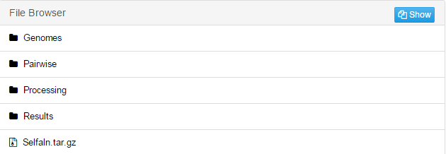
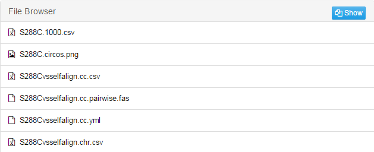
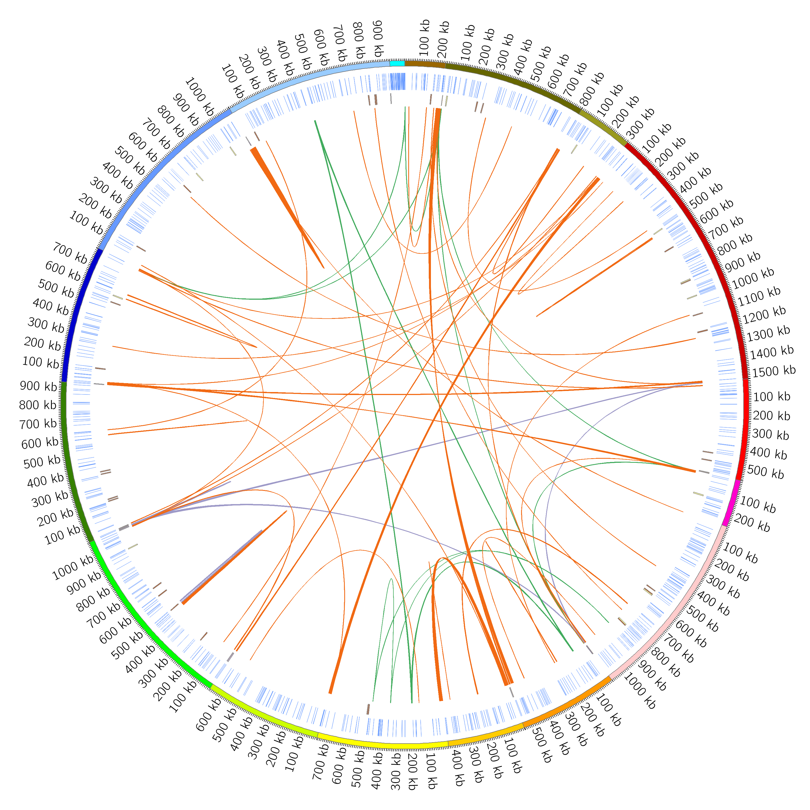
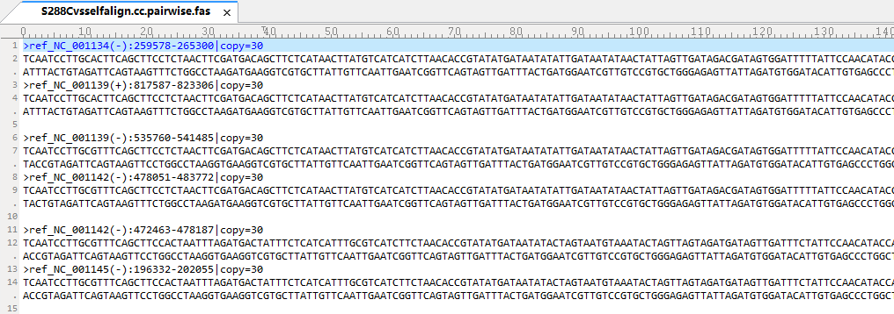

# For paralogous alignment

The result folder contains contents as below:
	1. Similar to the multiple genomes alignment, Genomes, Pairwise and Processing folders contain intermediate files.

	2. Results: Contains the circos graphic showing the paralogous identified by self-alignment and the final result file listing pairwise paralog sequences in .fas file. Other files are intermediate files.

Circos graphic:

Pairwise paralog sequences:
