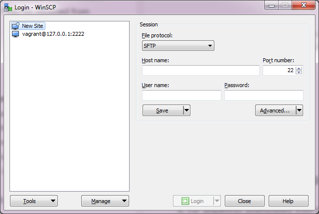
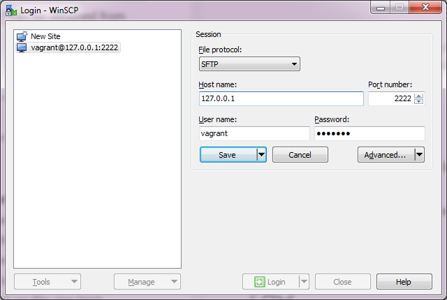
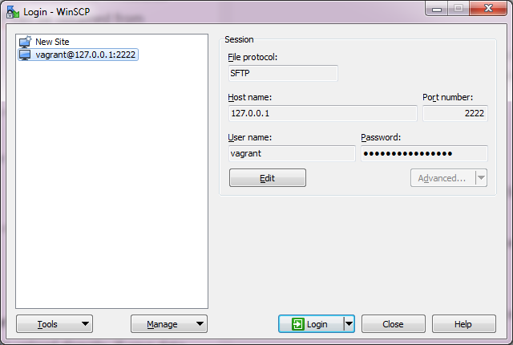
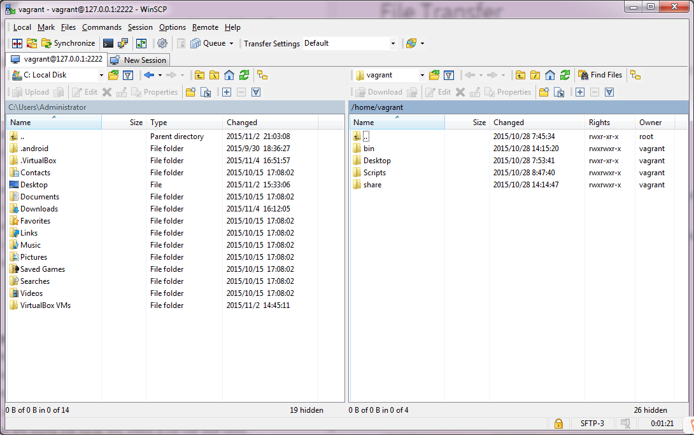

# Log in

First, make sure your VM is in an open status.
After WinSCP is installed, launch WinSCP and you will see an interface like this.

Set the host name, port number, user name as the following picture shows and set the password as "vagrant". 

Click "Save". This site will be saved for logging in next time.

Click "Login". The interface will be shown as below.
