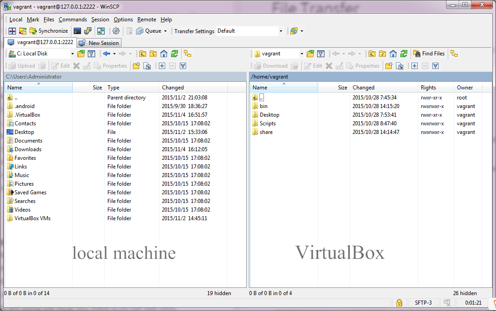

# Transfer

Contents of your local machine are listed on the left column and contents of your VM are listed on the right. You can simply drag a file or a folder between the left and right column to transfer files between local machine and VirtualBox.
